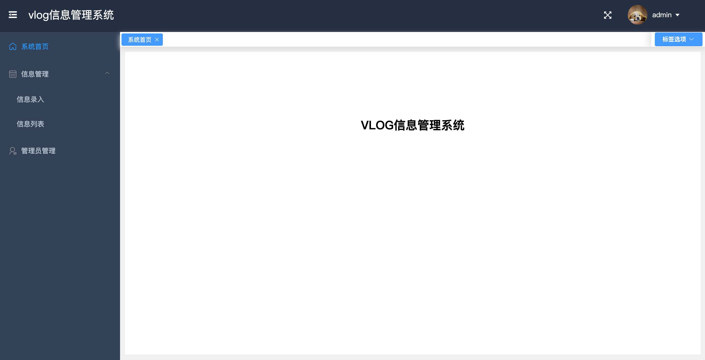
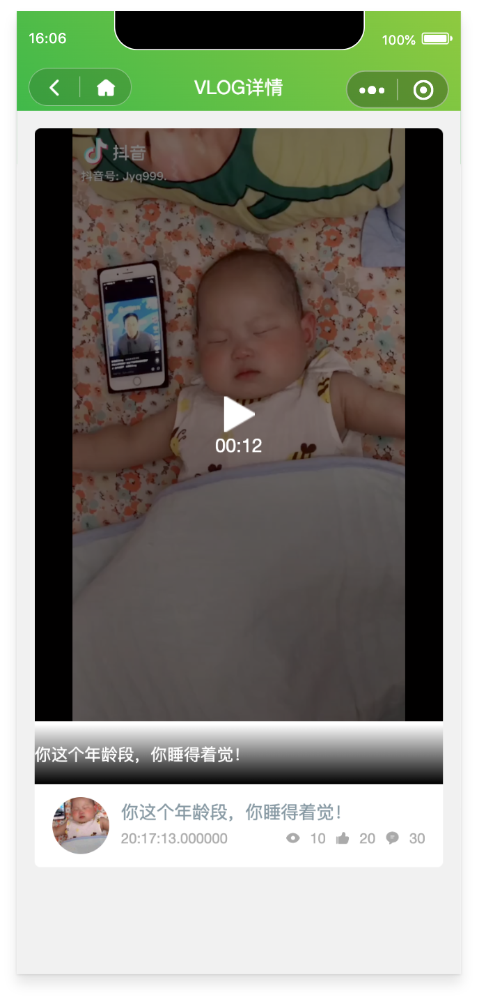
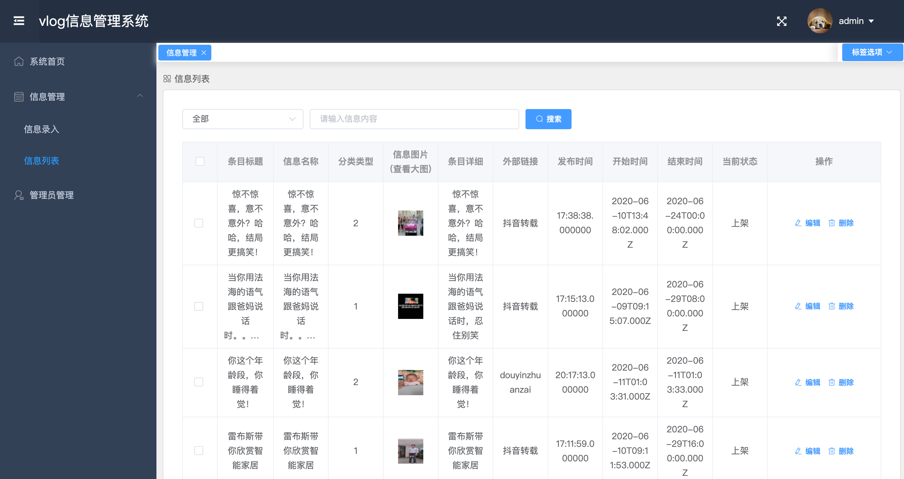
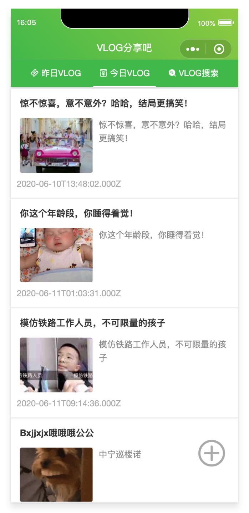
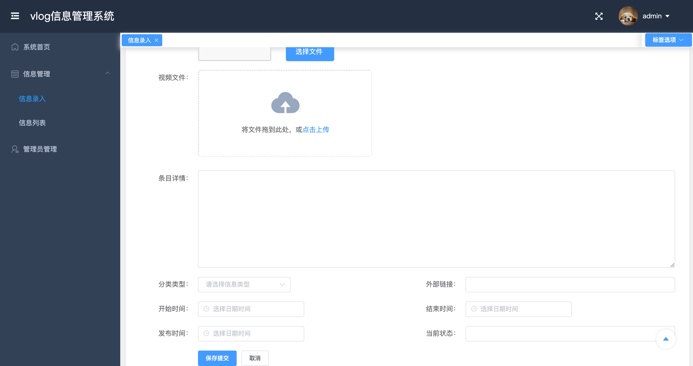
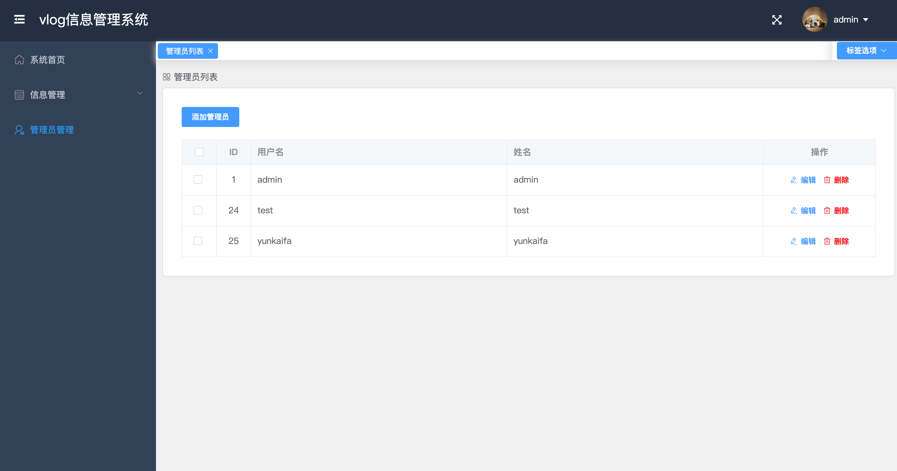

# 纯前端实现前后端简易vlog系统
>> 用到的技术栈：
  1. 前端（H5/mini）: vue + 小程序 + corlorUI
  2. 前端（管理端）： vue + elementUI
  3. 后端：koa2 + jwt + mysql

## 部分效果图
 
 
 
 
 
 

## 
## H5/小程序端接口
1. /sys/getTag?id=1  get 查询某一条数据
2. /sys/getAllTag?type=1&search=a get 查询所有符合条件的数据
3. 暂不开放删除和新增接口

## 管理端接口 （生成token）
1. /sys/login  post  登录（生成token）
2. /sys/findAllTag?type=1&search=a  get 查询所有符合条件的数据
3. /sys/findTag?id=1  get 查询某一条数据
4. /sys/updateTag?id=1 post 更新（修改）某一条数据
5. /sys/addTag post 新增某一条数据
6. /sys/deleteAllTag get 删除所有数据
7. /sys/deleteTag?id=1  get 删除某一条数据
8. /sys/uploadfile  post 上传文件
9. /sys/getAdminList get  查找所有管理员
10. /sys/deleteAdmin get  删除某个管理员
11. /sys/addAdmin post 新增管理员
12. /sys/updateAdmin post 修改管理员